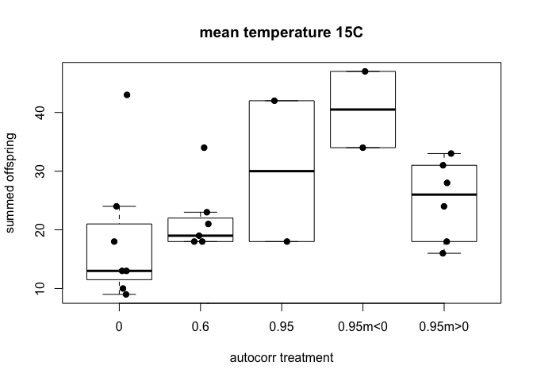

Anova for the pea-aphid experiment at 15 C - autocorrelated temperatures
================
Kim based on tidyverse dependent code from Jon, Champ, Sunandan, Debora
10/08/2021

### Purpose

To determine if there is a significant relationship between aphid
offspring (dependent variable) and different autocorrelated temperature
regimes (independent variable)

### Download the data from github repo and check import

``` r
datin <- read.csv("https://raw.githubusercontent.com//Cuddington-Lab/thermal-experiments/main/expdata_metafile_01062021.csv",
              header=TRUE, stringsAsFactors = TRUE)
str(datin)
```

    ## 'data.frame':    82 obs. of  14 variables:
    ##  $ Experiment_Number: int  2 2 2 2 3 3 3 3 4 4 ...
    ##  $ Mean_Temp        : int  15 15 15 15 19 19 19 19 23 23 ...
    ##  $ Experiment_Start : Factor w/ 22 levels "11-Oct","13-Dec",..: 11 11 11 11 7 7 7 7 22 22 ...
    ##  $ Experiment_End   : Factor w/ 22 levels "11-Dec","11-Mar",..: 16 16 16 16 21 21 21 21 5 5 ...
    ##  $ Profile_name     : Factor w/ 69 levels "simplelong_23_000_3",..: 13 23 18 24 32 33 34 35 36 37 ...
    ##  $ Autocorrelation  : num  0 0.9 0.6 0.9 0 0.6 0.95 0.95 0 0.6 ...
    ##  $ Incubator        : int  1 3 5 6 1 3 5 6 1 3 ...
    ##  $ Offspring_Plant1 : int  0 6 0 0 12 19 22 19 21 23 ...
    ##  $ Offspring_Plant2 : int  8 6 3 0 16 16 23 17 21 26 ...
    ##  $ Offspring_Plant3 : int  1 0 4 1 21 14 8 8 22 20 ...
    ##  $ Duckweed_Rep1    : int  NA NA NA NA NA NA NA NA NA NA ...
    ##  $ Duckweed_Rep2    : int  NA NA NA NA NA NA NA NA NA NA ...
    ##  $ Duckweed_Rep3    : int  NA NA NA NA NA NA NA NA NA NA ...
    ##  $ Cat              : Factor w/ 3 levels "N","N/A","P": 2 2 2 2 2 2 3 1 2 2 ...

### Complete any data manipulations

Create new data frame including only mean temp of 15C, remove 0.9
autocorrelation treatments, and check

``` r
dat <- datin[datin$Mean_Temp == 15 & datin$Autocorrelation!=0.9,]
table(dat$Mean_Temp,dat$Autocorrelation)
```

    ##     
    ##       0 0.6 0.95
    ##   15  7   7   10

Create new treatment label and check

``` r
table(dat$Autocorrelation, dat$Cat)
```

    ##       
    ##        N N/A P
    ##   0    0   7 0
    ##   0.6  0   7 0
    ##   0.95 2   2 6

``` r
levels(dat$Cat) = c("m<0","", "m>0" )
dat$label<-paste0(dat$Autocorrelation, dat$Cat)
table(dat$label)
```

    ## 
    ##       0     0.6    0.95 0.95m<0 0.95m>0 
    ##       7       7       2       2       6

So we have 2, 0.95 treatments without a slope estimate??

Create new column including sum of offspring (sumOff)

``` r
str(dat)
```

    ## 'data.frame':    24 obs. of  15 variables:
    ##  $ Experiment_Number: int  2 2 7 7 8 8 8 8 9 9 ...
    ##  $ Mean_Temp        : int  15 15 15 15 15 15 15 15 15 15 ...
    ##  $ Experiment_Start : Factor w/ 22 levels "11-Oct","13-Dec",..: 11 11 15 15 20 20 20 20 3 3 ...
    ##  $ Experiment_End   : Factor w/ 22 levels "11-Dec","11-Mar",..: 16 16 19 19 3 3 3 3 8 8 ...
    ##  $ Profile_name     : Factor w/ 69 levels "simplelong_23_000_3",..: 13 18 13 18 14 19 25 29 29 25 ...
    ##  $ Autocorrelation  : num  0 0.6 0 0.6 0 0.6 0.95 0.95 0.95 0.95 ...
    ##  $ Incubator        : int  1 5 1 3 1 3 5 6 1 3 ...
    ##  $ Offspring_Plant1 : int  0 0 12 4 8 3 13 7 3 17 ...
    ##  $ Offspring_Plant2 : int  8 3 3 11 4 7 9 11 8 11 ...
    ##  $ Offspring_Plant3 : int  1 4 9 3 6 8 25 10 7 14 ...
    ##  $ Duckweed_Rep1    : int  NA NA NA NA NA NA NA NA NA NA ...
    ##  $ Duckweed_Rep2    : int  NA NA NA NA NA NA NA NA NA NA ...
    ##  $ Duckweed_Rep3    : int  NA NA NA NA NA NA NA NA NA NA ...
    ##  $ Cat              : Factor w/ 3 levels "m<0","","m>0": 2 2 2 2 2 2 1 3 2 2 ...
    ##  $ label            : chr  "0" "0.6" "0" "0.6" ...

``` r
dat$sumOff=dat$Offspring_Plant1+dat$Offspring_Plant2+dat$Offspring_Plant3
```

### Plot

``` r
tr=boxplot(sumOff~label, data=dat,main="mean temperature 15C",outline=FALSE,
           xlab="autocorr treatment", ylab="summed offspring",
  names = levels(as.factor(dat$label)))

stripchart(sumOff~label, data=dat, 
           vertical = TRUE, method = "jitter",
           pch = 19, add = TRUE) 
```

<!-- -->

``` r
         #  col = 1:length(levels(dat$labels)))
```

### Stats

``` r
 l1=lm(sumOff~label, data=dat)
 summary(l1)
```

    ## 
    ## Call:
    ## lm(formula = sumOff ~ label, data = dat)
    ## 
    ## Residuals:
    ##     Min      1Q  Median      3Q     Max 
    ## -13.000  -6.625  -1.000   5.571  24.429 
    ## 
    ## Coefficients:
    ##              Estimate Std. Error t value Pr(>|t|)    
    ## (Intercept)    18.571      3.730   4.979 8.33e-05 ***
    ## label0.6        1.429      5.275   0.271   0.7894    
    ## label0.95      11.429      7.912   1.444   0.1649    
    ## label0.95m<0   21.929      7.912   2.772   0.0122 *  
    ## label0.95m>0    6.429      5.490   1.171   0.2561    
    ## ---
    ## Signif. codes:  0 '***' 0.001 '**' 0.01 '*' 0.05 '.' 0.1 ' ' 1
    ## 
    ## Residual standard error: 9.868 on 19 degrees of freedom
    ## Multiple R-squared:  0.3348, Adjusted R-squared:  0.1948 
    ## F-statistic: 2.391 on 4 and 19 DF,  p-value: 0.08691

### Format results

Adding a table of results for Jorren’s benefit

``` r
 library(kableExtra)
kable_classic(kable((summary(l1)$coefficients)))
```

<table class=" lightable-classic" style="font-family: &quot;Arial Narrow&quot;, &quot;Source Sans Pro&quot;, sans-serif; margin-left: auto; margin-right: auto;">
<thead>
<tr>
<th style="text-align:left;">
</th>
<th style="text-align:right;">
Estimate
</th>
<th style="text-align:right;">
Std. Error
</th>
<th style="text-align:right;">
t value
</th>
<th style="text-align:right;">
Pr(>\|t\|)
</th>
</tr>
</thead>
<tbody>
<tr>
<td style="text-align:left;">
(Intercept)
</td>
<td style="text-align:right;">
18.571429
</td>
<td style="text-align:right;">
3.729797
</td>
<td style="text-align:right;">
4.9792063
</td>
<td style="text-align:right;">
0.0000833
</td>
</tr>
<tr>
<td style="text-align:left;">
label0.6
</td>
<td style="text-align:right;">
1.428571
</td>
<td style="text-align:right;">
5.274730
</td>
<td style="text-align:right;">
0.2708331
</td>
<td style="text-align:right;">
0.7894397
</td>
</tr>
<tr>
<td style="text-align:left;">
label0.95
</td>
<td style="text-align:right;">
11.428571
</td>
<td style="text-align:right;">
7.912094
</td>
<td style="text-align:right;">
1.4444433
</td>
<td style="text-align:right;">
0.1649039
</td>
</tr>
<tr>
<td style="text-align:left;">
label0.95m\<0
</td>
<td style="text-align:right;">
21.928571
</td>
<td style="text-align:right;">
7.912094
</td>
<td style="text-align:right;">
2.7715256
</td>
<td style="text-align:right;">
0.0121537
</td>
</tr>
<tr>
<td style="text-align:left;">
label0.95m>0
</td>
<td style="text-align:right;">
6.428571
</td>
<td style="text-align:right;">
5.490113
</td>
<td style="text-align:right;">
1.1709362
</td>
<td style="text-align:right;">
0.2561010
</td>
</tr>
</tbody>
</table>
